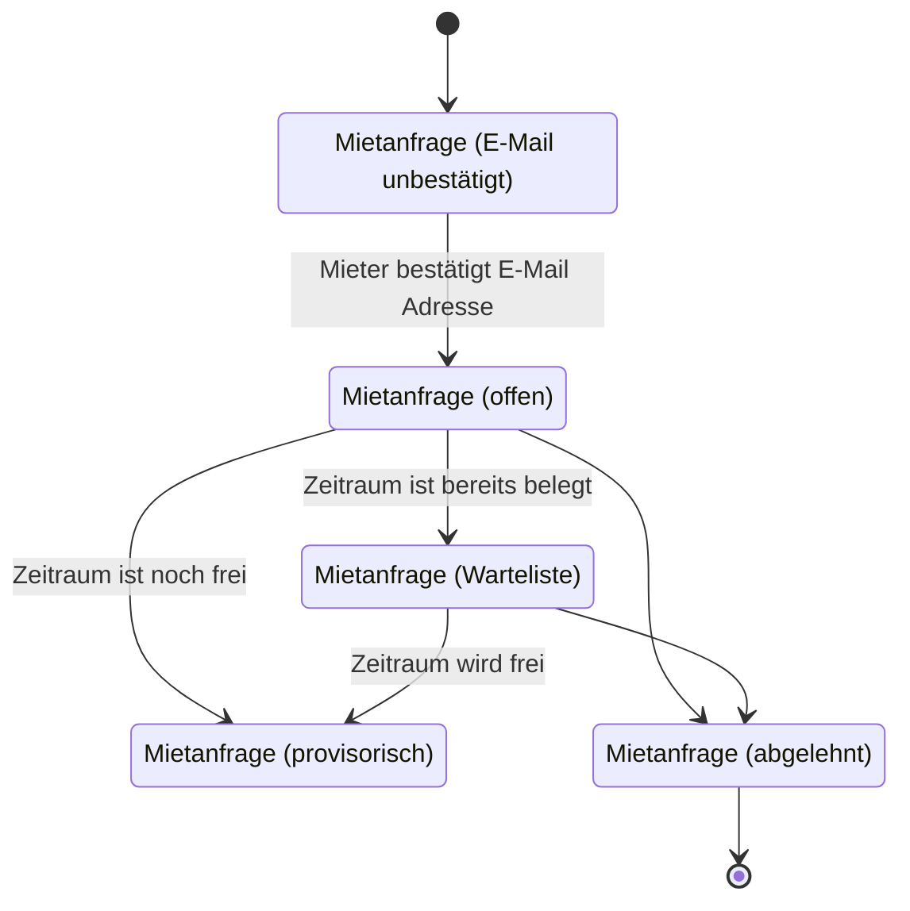

Grundsätzlich ist es in HeimV nicht möglich, dasselbe Mietobjekt gleichzeitig in mehreren Buchungen zu vermieten. Anfragen für bereits belegte Mietobjekte können gar nicht erst von Mietern erstellt werden. 

Die Verwaltung hat die Möglichkeit, bei einzelnen Buchungen die *Terminkonflikte zu ignorieren*. Dies führt aber dazu, dass die Terminkonflikte dieser Buchung **gar nicht mehr überprüft werden**.

Es kommt vor, dass eine Anfrage in einer Absage endet und der Zeitraum dann wieder frei ist. HeimV bietet seit der Version 25.6.1 die Möglichkeit, eine *Warteliste* zu führen, damit in diesem Fall der freie Zeitraum direkter an andere Interessenten weitergegeben werden kann.

## Funktionsweise

Wenn die Warteliste eingeschaltet ist, erlaubt das System zusätzliche Reservationsanfragen für Zeiträume, die **bereits belegt** sind (z.B. durch eine provisorische Buchung). 

Die Anfrage muss zunächst durch die Verwaltung akzeptiert werden, bevor sie den neuen Status «Warteliste» erhält. Wird der angefragte Zeitraum frei, kann eine Anfrage aus der Warteliste herausgepickt, *befördert* und weiter bearbeitet werden. Wird eine bestehende Anfrage definitiv, können die übrigen Anfragen in der Warteliste unkompliziert abgesagt werden.

